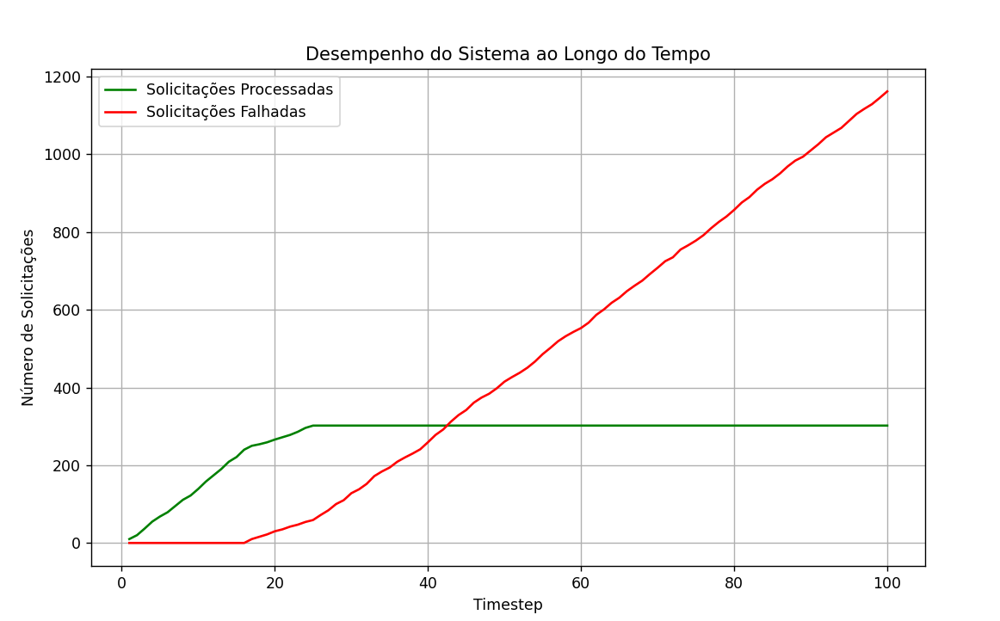

# Sistema Distribuído de Atendimento ao Cliente com Tolerância a Falhas

## Descrição do Projeto
Este projeto implementa um sistema distribuído de atendimento ao cliente que simula o processamento de solicitações com tolerância a falhas e balanceamento de carga. O sistema gerencia:
- **Solicitações de clientes**: Divididas em dois tipos — "Técnica" e "Vendas".
- **Atendentes**: Responsáveis pelo processamento das solicitações, sujeitos a falhas simuladas.
- **Servidores**: Agrupam atendentes e possuem capacidade limitada de processamento.
- **Supervisor**: Realoca solicitações entre servidores quando necessário.
- **Simulador de Falhas**: Introduz falhas nos atendentes para testar a tolerância a falhas.

O sistema avalia o impacto de falhas e gargalos no desempenho através da análise de logs e gráficos.

---

## Funcionalidades
1. **Processamento de Solicitações**
   - Cada solicitação é processada por atendentes compatíveis com o tipo de solicitação.
   - Em caso de falha ou indisponibilidade, as solicitações são redirecionadas entre servidores.

2. **Tolerância a Falhas**
   - Um simulador injeta falhas nos atendentes com uma probabilidade ajustável.
   - O sistema redistribui as solicitações quando falhas ocorrem.

3. **Balanceamento de Carga**
   - Solicitações são armazenadas em um buffer limitado e distribuídas entre servidores de acordo com a disponibilidade.

4. **Geração de Relatórios**
   - Logs detalham o número de solicitações processadas, falhas e o tamanho do buffer a cada timestep.
   - Gráficos mostram o desempenho do sistema ao longo do tempo.

---

## Estrutura do Código
1. **Classes Principais**
   - **`SolicitaçãoCliente`**: Representa as solicitações criadas pelos clientes.
   - **`Atendente`**: Processa solicitações; pode entrar em falha.
   - **`Servidor`**: Armazena e gerencia atendentes.
   - **`Supervisor`**: Coordena a realocação de solicitações entre servidores.
   - **`SimuladorFalhas`**: Simula falhas aleatórias nos atendentes.
   - **`GeradorSolicitacoes`**: Gera solicitações de clientes aleatoriamente.

2. **Simulação**
   - Gera solicitações e as aloca no buffer.
   - Injeta falhas nos atendentes.
   - Processa as solicitações no buffer, redirecionando quando necessário.
   - Registra dados para análise.

3. **Análise e Visualização**
   - Criação de logs em formato de DataFrame (`pandas`).
   - Gráficos com `matplotlib` para visualizar o desempenho.

---

## Como Usar
1. **Pré-requisitos**
   - Python 3.8+
   - Bibliotecas necessárias: `pandas`, `matplotlib`, `random`, `threading`, `queue`.

2. **Execução**
   - Execute o arquivo principal contendo o código.
   - A simulação processará 100 timesteps, gerando logs e gráficos.

3. **Saída**
   - Tabela de logs com o número de solicitações processadas, falhas e estado do buffer.
   - Gráfico de linha mostrando o desempenho do sistema:
     - **Solicitações Processadas**: Representadas em verde.
     - **Solicitações Falhadas**: Representadas em vermelho.

---

## Gráficos Gerados
1. **Desempenho do Sistema**
   - Gráfico que exibe o número de solicitações processadas e falhadas ao longo do tempo.

2. **Análise de Falhas**
   - Frequência de falhas dos atendentes e o impacto no desempenho geral.
